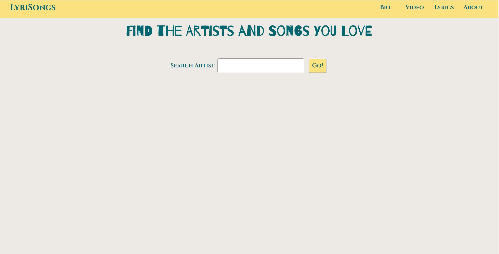

# LyriSongs
## Summary
An app that conveniently lets the user search for a Band/Musician, search for a song and get the lyrics for that song all in one platform, right here **[LyriSongs](https://mzibari.github.io/lyrisongs/)**.
The user starts by searching for a Band/Musician, the app will display a short bio and some general information, the user then can search for a song and that
wil retrieve a YouTube video of that song, and under that will display the lyrics.

### Homepage

### Searching for a Musician 

### Searching for a song

**Technologies used**
- HTML
- CSS
- JavaScript
- JQuery 

**API's used**
- YouTube API
- The Audio DB API
- LyricsOVH API
